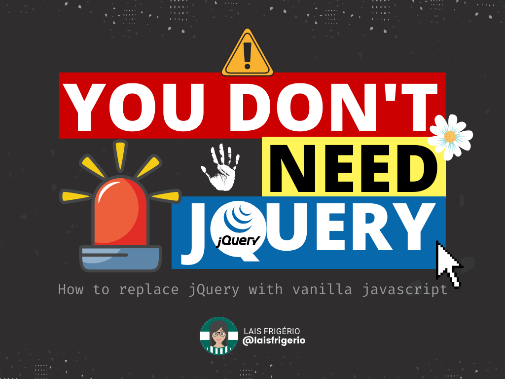

# 🚫 You don't need Jquery

Replace jQuery methods with Vanilla Javascript

<p align="center">
  <a></a>
</p>

## 📝 Table of Content

1. [Select something](#select-something)
2. [Select something within a parent](#select-something-within-a-parent)
3. [Add class](#add-class)
4. [Remove class](#remove-class)
5. [Get attribute](#get-attribute)
6. [Set attribute](#set-attribute)
7. [Get data attribute](#get-data-attribute)
8. [Set data attribute](#set-data-attribute)
9. [Get Text](#get-text)
10. [Get HTML](#get-html)
11. [Insert HTML string](#insert-html-string)
12. [Insert text string](#insert-text-string)
13. [Show element](#show-element)
14. [Hide element](#hide-element)
15. [Show element with transition](#show-element-with-transition)
16. [Hide element with transition](#hide-element-with-transition)
17. [Loop through Array](#loop-through-array)
18. [Loop through Object](#loop-through-object)
19. [Add Event Listener](#add-event-listener)
20. [Ajax request](#ajax-request)

## How to replace Jquery with Vanilla Javascript

### 1. Select something

- jQuery

```js
  $('.class-name');
```

- Vanilla Javascript

```js
  document.querySelector('.class-name'); // single
  document.querySelectorAll('.class-name'); // multiple
```

### 2. Select something within a parent

```js
  parent.find('.class-name');
```

- Vanilla Javascript

```js
  parent.querySelector('.class-name'); // single
  parent.querySelectorAll('.class-name'); // multiple
```

### 3. Add class

❌

```js
  element.addClass('.class-name');
```

✔️

```js
  element.classList.add('.class-name');
```

### 4. Remove class

- jQuery

```js
  element.removeClass('.class-name');
```

- Vanilla Javascript

```js
  element.classList.remove('.class-name');
```

### Get attribute

### Set attribute

### Get data attribute

### Set data attribute

### Get Text

### Get HTML

### Insert HTML string

### Insert text string

### Show element

### Hide element

### Show element with transition

### Hide element with transition

### Loop through Array

### Loop through Object

### Add Event Listener

### Ajax request

## :woman: Author

| [<br /><sub><b>@laisfrigerio</b></sub>](https://github.com/laisfrigerio)<br /> |
| :---: |

## 📄 License

This project is licensed under the MIT License - see the LICENSE.md file for details